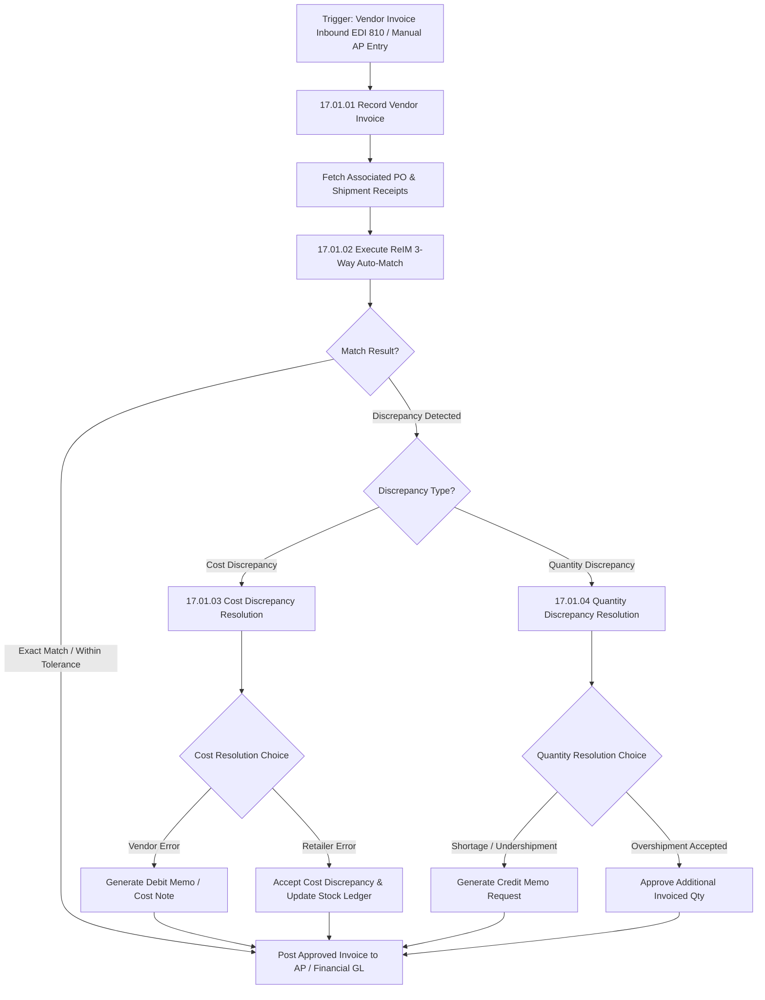

# ReIM Invoice Matching - RRL 16 Business Process Flows (RRM 17)

This reference documents the official Oracle **Retail Reference Model (RRM 17 Financial Control & Reporting / ReIM)** business process flows, 3-way invoice matching rules, discrepancy resolution lifecycles, and credit/debit memo workflows.

---

## 1. Process Overview & Key Operational Roles

Retail Invoice Matching (ReIM) performs 3-way matching between Vendor Invoices, Purchase Orders (`ORDHEAD`), and Physical Warehouse/Store Goods Receipts (`SHIPMENT`/`RECEIPT`).

### Operational Roles:
- **Accounts Payable (AP) Specialist**: Inputs manual invoices, reviews matching queues, resolves cost/quantity discrepancies.
- **Automated Matching Engine (ReIM Batch)**: Executes summary matching, line-level matching, and auto-resolution within tolerance thresholds.
- **Supplier / Vendor**: Sends electronic invoices (EDI 810) and receives Debit Memos / Credit Requests.

---

## 2. Core Business Process Workflows

---

## 3. Sub-Process Breakdown & Matching Rules

### Sub-Process 17.01.02: 3-Way Summary & Line Matching Engine
1. **Summary Match**: Compares Total Merchandise Invoiced Amount against Total Merchandise Received Amount for a PO/Location.
2. **Tolerance Checking**: Compares variance percentage against pre-configured tolerance limits (`SYSTEM_OPTIONS` or Supplier Group tolerances).
3. **Line Match**: If summary match fails, evaluates line item unit cost (`INVC_DETAIL.UNIT_COST` vs `ORDLOC.UNIT_COST`) and received quantity (`INVC_DETAIL.QTY` vs `SHIPSKU.QTY_RECEIVED`).

### Sub-Process 17.01.03: Cost Discrepancy Resolution
- **Debit Memo Creation**: If invoice unit cost exceeds PO cost and supplier is at fault, ReIM automatically generates a Debit Memo (`INVC_HEAD.TYPE = 'DEBIT'`) sent to AP/Vendor.
- **Credit Memo Request**: If invoice unit cost is less than PO cost, a Credit Note Request is dispatched to the vendor.

### Sub-Process 17.01.04: Quantity Discrepancy Resolution
- **Receiving Audit**: Compares warehouse license plate / BOL receipt scans against invoice item lines.
- **Shortage Claim**: Automatic generation of Credit Memo Requests for short-shipped lines.

---

## 4. ReIM Master Table & Financial State Data Flow

| Stage | ReIM Master Tables | Financial Posting / Interfaces |
| :--- | :--- | :--- |
| **Inbound Invoice Entry** | `INVC_HEAD`, `INVC_DETAIL` | EDI 810 Inbound |
| **Matching Queue** | `INVC_MATCH_QUEUE`, `INVC_XREF` | Internal ReIM Batch Match Engine |
| **Discrepancy Hold** | `INVC_DISC_COST`, `INVC_DISC_QTY` | AP Discrepancy Workspace |
| **Approved AP Export** | `INVC_HEAD.STATUS = 'APPROVED'` | Oracle Financials / AP GL Outbound (`saexpim`) |
