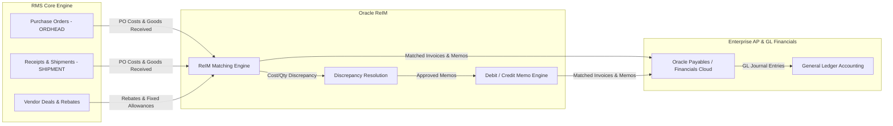

# ReIM Invoice Matching - RRL 16 Product Architecture (RRA & RSG)

This reference details the **Oracle Retail Reference Architecture (RRA)** product domain mappings, financial system integrations, and **Retail Service Group (RSG)** interfaces for Oracle Retail Invoice Matching (ReIM).

---

## 1. Enterprise Financial & Invoicing Product Architecture

---

## 2. Integration Interfaces & Service Payloads (RSG)

| Service Interface | Target System | Message Payload / Protocol | Description |
| :--- | :--- | :--- | :--- |
| **`PayablesInbound`** | EDI 810 / Supplier Portal | `InvoiceInboundDesc` | Ingests vendor invoices electronically into ReIM staging (`INVC_HEAD`). |
| **`FinancialsAPOut`** | Oracle ERP / EBS / Cloud AP | `FinancialsAPDesc` | Exports matched invoices, debit memos, and credit notes to Accounts Payable. |
| **`FinancialsGLOut`** | General Ledger Engine | `GLPostingDesc` | Posts non-merchandise expenses, freight charges, and cost variances to GL accounts. |

---

## 3. Architecture & Data Integrity Rules

1. **Independent Matching Engine**: ReIM operates as a standalone server application that queries RMS PO (`ORDHEAD`) and Shipment (`SHIPMENT`) tables read-only, and writes back invoice match status.
2. **Tolerance Configurations**: Tolerances can be configured globally, by department, or by supplier trait.
3. **Strict Auditability**: Every discrepancy resolution requires a reason code (`CODE_DETAIL` type `REAS`) linked to specific GL accounts.
