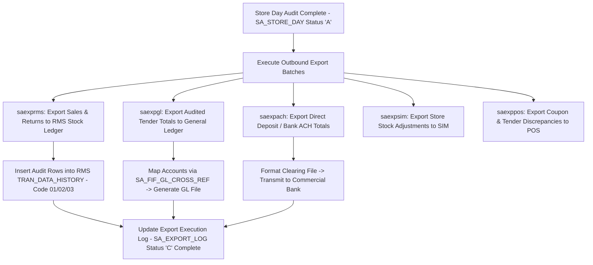

# ReSA Sales Audit Exports - Business Process Flows (ReSA OG & UG Ch 8)

This reference documents the official **Oracle Retail Sales Audit (ReSA) Operations Guide & User Guide (Chapter 8 - Exporting Data)** business process flows for outbound financial posting to RMS Stock Ledger, General Ledger (GL), Bank ACH, SIM/WMS, and POS.

---

## 1. Process Overview & Key Roles

ReSA Outbound Exports extracts fully audited transaction data, store day totals, and tender summaries, transforming and posting them to target enterprise systems once a Store Day reaches Audited status (`SA_STORE_DAY.STATUS = 'A'`).

### Operational Roles:
- **Sales Auditor**: Reviews export status logs (`SA_EXPORT_LOG`), resolves export validation errors, initiates manual re-export requests.
- **Export Batch Engine (`saexprms`, `saexpgl`, `saexpach`)**: Extracts audited records, validates cross-reference mappings, writes output files/tables, updates export log status.
- **Enterprise ERP / Financial Controller**: Ingests GL export files (`saexpgl`) for corporate financial accounting.

---

## 2. ReSA Export Execution Workflow

---

## 3. Sub-Process Breakdown & Batch Programs

### Sub-Process 8.1: RMS Stock Ledger Export (`saexprms`)
- Extracts audited sales, returns, discounts, taxes, and promotional markdowns.
- Posts financial records directly into RMS `TRAN_DATA_HISTORY` (Code 01 - Sales, Code 02 - Returns, Code 03 - Sales Tax, Code 11/12 - Promotional Markdowns).

### Sub-Process 8.2: General Ledger Export (`saexpgl`)
- Maps audited store day tender totals and cash/credit accounts via `SA_FIF_GL_CROSS_REF`.
- Writes financial journal debits and credits for enterprise ERP (Oracle Financials Cloud / SAP).

### Sub-Process 8.3: Bank ACH Export (`saexpach`)
- Formats store bank deposit slips (`SA_BANK_STORE`) and electronic bank statements (`SA_BANK_ACH`) into automated clearinghouse (ACH) clearing records.
