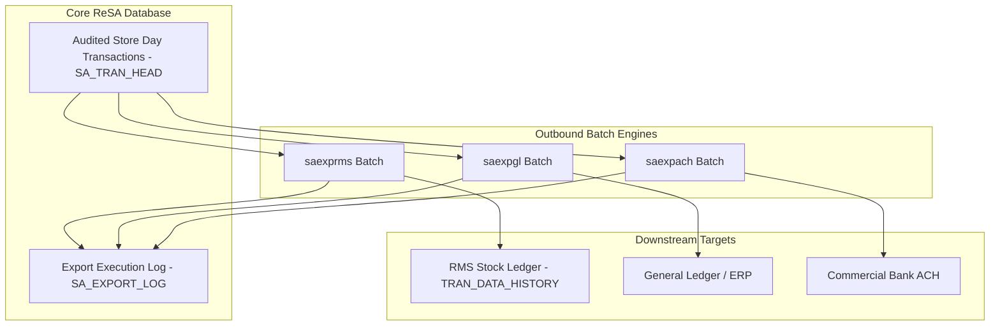

# ReSA Sales Audit Exports - Product Architecture (ReSA OG Ch 2 & 12)

This reference documents the **Oracle Retail Sales Audit (ReSA)** export product architecture, ADF taskflows, RESTful Web Services, and RIB payload contracts for outbound integration.

---

## 1. Export Integration Topology

---

## 2. Interface Schemas & Web Services

| Batch / Interface | Target System | Data Exchanged |
| :--- | :--- | :--- |
| **`saexprms`** | RMS Stock Ledger | Audited sales, returns, discounts, sales tax, markdowns. |
| **`saexpgl`** | Oracle ERP / GL | Audited tender totals mapped to GL account combinations. |
| **`saexpach`** | Commercial Bank | Bank deposit slips and ACH transmission clearance. |
| **`saexpsim`** | SIM / WMS | Real-time inventory adjustment receipts from POS returns. |
| **`saexppos`** | Xstore POS | Cashier over/short feedback and coupon validation errors. |
