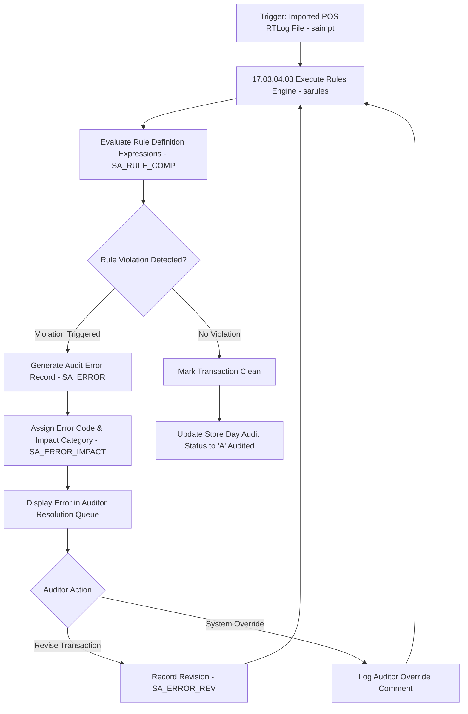

# ReSA Audit Rules Engine - RRL 16 Business Process Flows (RRM 17)

This reference documents the official Oracle **Retail Reference Model (RRM 17 Financial Control - ReSA Audit Rules Engine)** business process flows, rule definition, validation error evaluation, error impact categorization, and error revision workflows.

---

## 1. Process Overview & Key Operational Roles

The ReSA Audit Rules Engine evaluates imported POS transactions against configured business validation rules to catch duplicate transactions, missing tax codes, invalid tender amounts, price overrides, and missing cashier signatures before financial posting.

### Operational Roles:
- **Audit Rule Administrator**: Configures validation rules (`SA_RULE_COMP`), assigns error codes (`SA_ERROR_CODES`), defines system parameters (`SA_PARM`).
- **Sales Auditor**: Reviews generated error records (`SA_ERROR`), overrides validation warnings, submits revised transaction values (`SA_ERROR_REV`).
- **Audit Execution Engine (`sarules`)**: Evaluates rule expressions, logs errors to `SA_ERROR_WKSHT`, and updates store day audit status.

---

## 2. Core Business Process Workflows

---

## 3. Sub-Process Breakdown & Rules Engine Components

### Sub-Process 17.03.04.03: Create & Maintain Audit Rules
1. **Rule Types**:
   - **System Rules**: Hardcoded core validation rules (e.g. Duplicate Transaction ID, Invalid Item Number).
   - **User-Defined Rules**: Flexible rules configured via PL/SQL boolean expressions (e.g. Cash payment > $10,000 requires Manager ID).
2. **Error Impact Categories (`SA_ERROR_IMPACT`)**:
   - **Fatal Error**: Prevents store day audit completion and blocks Stock Ledger export.
   - **Warning**: Logs warning record but permits store day audit closure.
