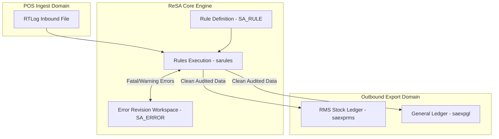

# ReSA Audit Rules Engine - RRL 16 Product Architecture (RRA & RSG)

This reference documents the **Oracle Retail Reference Architecture (RRA)** rules engine product domain mappings, validation error queue topology, and **Retail Service Group (RSG)** interface specs for ReSA Audit Rules.

---

## 1. Enterprise Rules Engine Product Architecture

---

## 2. RSG Integration Schemas & Interfaces

| Service Interface | Payload Schema | Description |
| :--- | :--- | :--- |
| **`AuditErrorOut`** | `AuditErrorDesc` | Transmits unhandled fatal audit errors to enterprise risk & loss prevention systems. |
| **`RuleConfigIn`** | `RuleConfigDesc` | Ingests external audit rule configurations and system parameters. |
