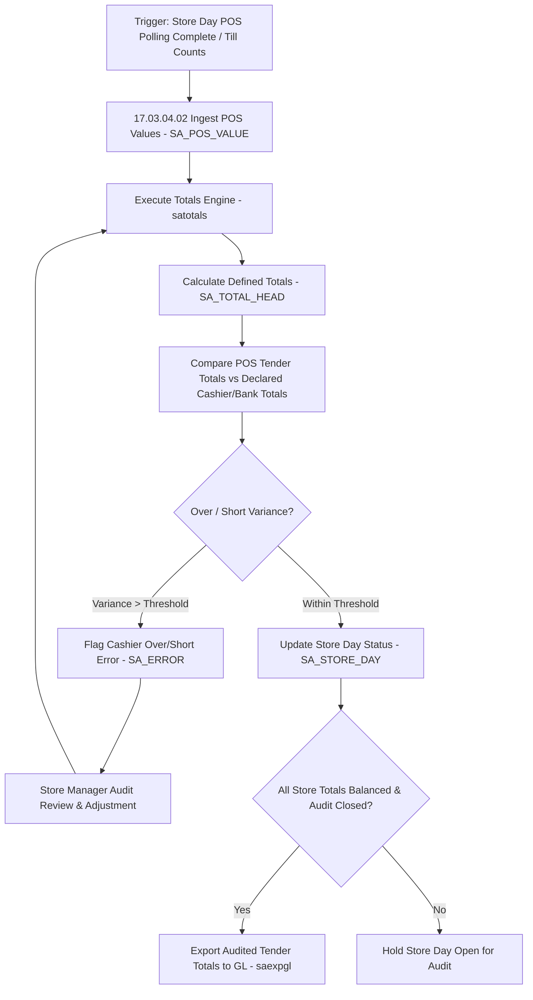

# ReSA Store Day Balances - RRL 16 Business Process Flows (RRM 17)

This reference documents the official Oracle **Retail Reference Model (RRM 17 Financial Control - ReSA Store Day & Totals Audit)** business process flows, cashier balancing, total definition calculations, bank ACH/deposit reconciliation, and store day lock management.

---

## 1. Process Overview & Key Operational Roles

Store Day Audit Balances tracks and balances daily cash drawer totals, cashier over/short amounts, credit card tender summaries, bank deposit slips, and store day audit closing statuses across retail stores.

### Operational Roles:
- **Head Cashier / Store Manager**: Performs end-of-day till counts, logs bank deposit slips (`SA_BANK_STORE`), balances cashier drawers.
- **Sales Auditor**: Configures custom totals (`SA_TOTAL_HEAD`), reconciles bank ACH statements (`SA_BANK_ACH`), resolves store day imbalances.
- **Totals Calculation Engine (`satotals`)**: Aggregates raw POS transaction tender records into defined store day totals (`SA_TOTAL_ITEM`).

---

## 2. Core Business Process Workflows

---

## 3. Sub-Process Breakdown & Totals Architecture

### Sub-Process 17.03.04.02: Create & Maintain Totals
1. **Total Types (`SA_TOTAL_HEAD.TOTAL_TYPE`)**:
   - **Tender Totals**: Cash, Visa, MasterCard, Amex, Gift Cards, Cheques.
   - **Sales Totals**: Total Gross Sales, Net Sales, Tax Collected, Discounts.
   - **Cashier Totals**: Per-cashier till balance and drawer overage/shortage.
2. **Total Level (`SA_TOTAL_HEAD.TOTAL_LEVEL`)**:
   - Store Level (`S`)
   - Register / Till Level (`R`)
   - Cashier / User Level (`C`)

### Sub-Process 17.03.04.05: Bank Deposit & ACH Reconciliation
- Compares store declared bank deposit slips (`SA_BANK_STORE`) against electronic bank statements (`SA_BANK_ACH`) to verify bank credit postings.
