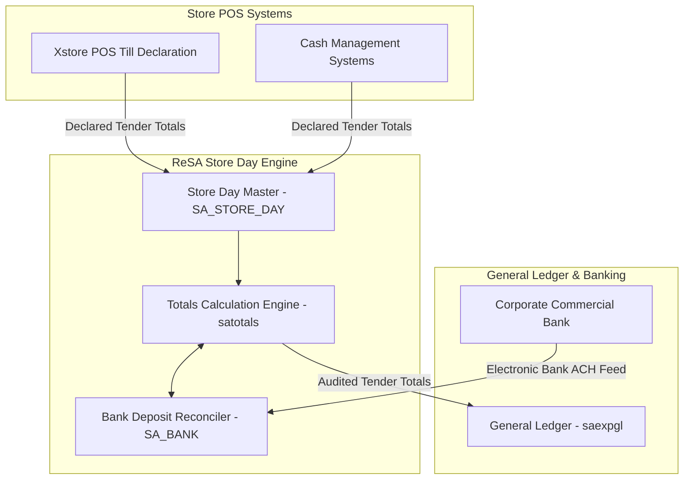

# ReSA Store Day Balances - RRL 16 Product Architecture (RRA & RSG)

This reference documents the **Oracle Retail Reference Architecture (RRA)** store day audit product domain mappings, cashier balancing topology, and **Retail Service Group (RSG)** interface specs for ReSA Store Day Balances.

---

## 1. Enterprise Store Day Product Architecture

---

## 2. RSG Integration Schemas & Interfaces

| Service Interface | Payload Schema | Description |
| :--- | :--- | :--- |
| **`TenderTotalsOut`** | `TenderTotalsDesc` | Exports audited tender totals to General Ledger for bank account reconciliation. |
| **`StoreDayStatusOut`** | `StoreDayStatusDesc` | Transmits store day audit status updates (Unedited, In-Progress, Closed). |
