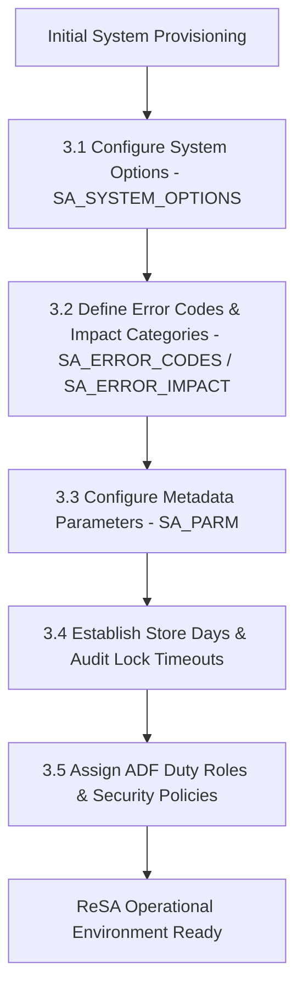

# ReSA System Setup & Security - Business Process Flows (ReSA UG Ch 3)

This reference documents the official **Oracle Retail Sales Audit (ReSA) User Guide (Chapter 3 - Setting up ReSA)** system setup flows, error code definition, parameter initialization, system options configuration, and security role administration.

---

## 1. Process Overview & Key Roles

System Setup & Configuration establishes global operational parameters governing transaction validation, rule execution thresholds, error severity levels, and security access permissions across Sales Auditors, Store Managers, and System Administrators.

### Operational Roles:
- **ReSA Administrator**: Configures system options (`SA_SYSTEM_OPTIONS`), defines error codes (`SA_ERROR_CODES`), manages parameter types (`SA_PARM_TYPE`).
- **Security Administrator**: Assigns ADF Security duty roles (Sales Auditor, Store Auditor, Audit Supervisor) and taskflow permissions.

---

## 2. System Setup Workflow

---

## 3. Sub-Process Breakdown

### Sub-Process 3.1: System Options Configuration
- Configures global audit behavior:
  - `AUDIT_LEVEL`: Store vs Till vs Cashier level auditing.
  - `BALANCING_LEVEL`: Strict balancing vs soft threshold warning.
  - `LOCK_TIMEOUT_MINUTES`: Lock duration for store day editing.

### Sub-Process 3.2: Error Codes & Impact
- Defines system error codes and categorizes them into **Fatal** (blocks audit completion and Stock Ledger export) or **Warning** (informational alert for auditor).
