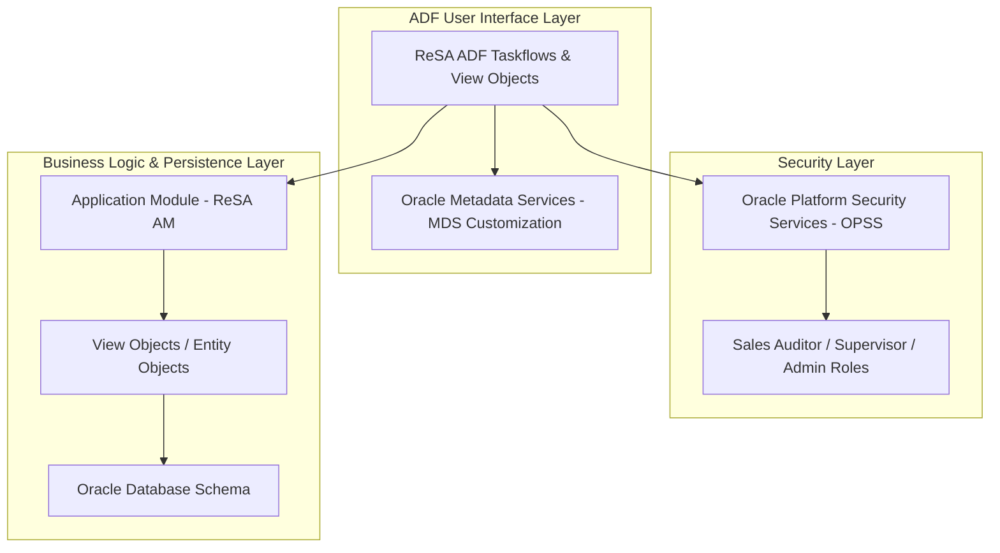

# ReSA System Setup - Product Architecture (ReSA OG Ch 2, 3, 4)

This reference documents the **Oracle Retail Sales Audit (ReSA)** ADF technical architecture, security role hierarchy, taskflow navigation, and MDS customization framework.

---

## 1. ADF Technical Architecture Layers

---

## 2. Default Security Role Hierarchy

| Job Role | Duty Role | Granted Access & Privileges |
| :--- | :--- | :--- |
| **Sales Auditor** | `Sales Auditor Duty` | Transaction audit workspace, error resolution, cashier balancing. |
| **Audit Supervisor** | `Audit Supervisor Duty` | Error overrides, store day status modifications, rule definitions. |
| **Sales Audit Admin** | `Sales Audit Admin Duty` | System options, error codes setup, parameter definitions, GL mapping. |
