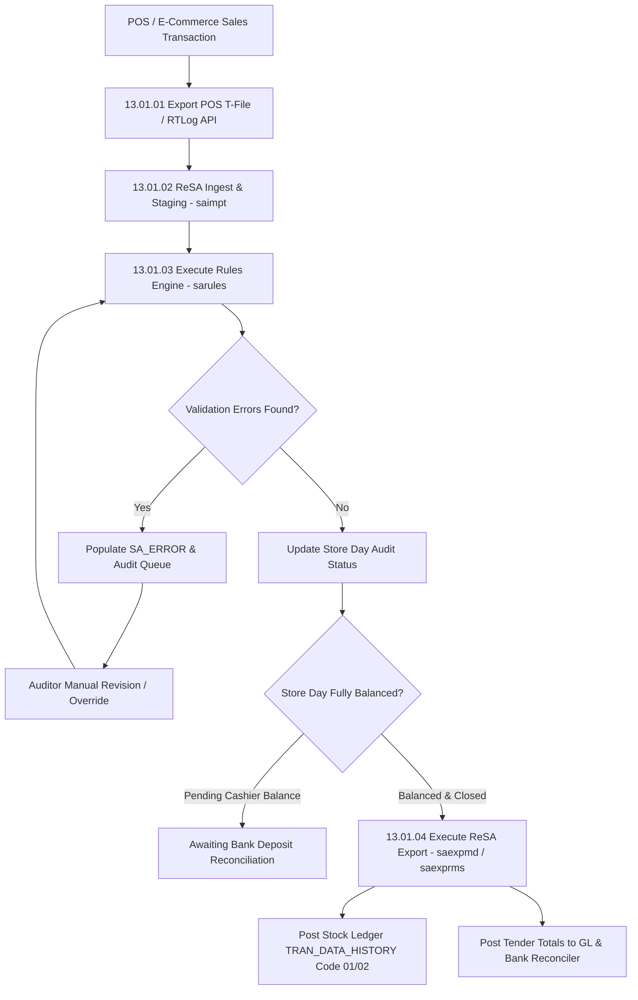

# ReSA Sales Audit - RRL 16 Business Process Flows (RRM 13 & 17)

This reference documents the official Oracle **Retail Reference Model (RRM 13 Store Operations & RRM 17 Financial Control / ReSA)** business process flows, POS transaction polling, store day balancing, cashier balancing, audit rule validation, and error revision workflows.

---

## 1. Process Overview & Key Operational Roles

Retail Sales Audit (ReSA) standardizes, validates, and audits Point of Sale (POS) and e-Commerce transaction data before exporting audited sales totals to RMS Stock Ledger (`TRAN_DATA_HISTORY`), RPM, ReIM, and General Ledger (GL).

### Operational Roles:
- **Sales Auditor**: Reviews audit errors (`SA_ERROR`), overrides validation warnings, makes manual transaction revisions (`SA_TRAN_HEAD` / `SA_TRAN_ITEM`).
- **Store Cashier / Head Cashier**: Balances store tills, bank deposits, and tender totals (`SA_TOTAL_HEAD`).
- **Automated Sales Audit Engine (`sastrip` / `saimpt` / `sarules`)**: Imports POS T-files, executes rule engine, and balances store days (`SA_STORE_DAY`).

---

## 2. Core Business Process Workflows

---

## 3. Sub-Process Breakdown & Audit Rules Engine

### Sub-Process 13.01.02: Ingestion & Transaction Processing
1. **RTLog / POS File Import**: Ingests raw POS files (`saimpt`), parsing Header (`SA_TRAN_HEAD`), Item Lines (`SA_TRAN_ITEM`), Tender Lines (`SA_TRAN_TENDER`), Tax (`SA_TRAN_TAX`), and Customer Data.
2. **Missing Transaction ID Check**: Detects sequence gaps in POS transaction numbers (`TRAN_SEQ_NO`).

### Sub-Process 13.01.03: Audit Rules & Balancing
1. **Rule Engine Execution (`sarules`)**: Evaluates user-defined rules (`SA_RULE`) such as Over/Short thresholds, duplicate transaction IDs, invalid promo codes, or tender imbalance.
2. **Store Day State (`SA_STORE_DAY.AUDIT_STATUS`)**:
   - `U` (Unedited / Raw Import)
   - `H` (In-Progress / Errors Pending)
   - `A` (Audited / Clean)

### Sub-Process 13.01.04: Export Postings
- **`saexprms`**: Exports item sales and return data to RMS inventory buckets (`ITEM_LOC_SOH`) and Stock Ledger (`TRAN_DATA_HISTORY` codes 01 - Sale, 02 - Return, 03 - Tax, 04 - Discount).
- **`saexpgl`**: Exports audited tender totals (Cash, Visa, Amex, Gift Cards) to Enterprise GL.
