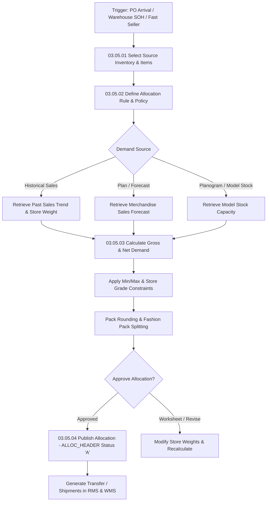

# RMS Allocations - RRL 16 Business Process Flows (RRM 03 & 05)

This reference documents the official Oracle **Retail Reference Model (RRM 03 Merchandise Planning & RRM 05 Supply Chain Allocation)** business process flows, demand distribution algorithms, allocation creation, What-If analysis, and store allocation approval rules.

---

## 1. Process Overview & Key Operational Roles

Store Allocation determines optimal merchandise quantity distribution from Warehouses or Purchase Orders to retail stores based on historical sales, sales forecasts, store grades, and planogram capacity.

### Operational Roles:
- **Allocation Analyst**: Creates allocation rules, selects source inventory (Warehouse SOH or PO), executes What-If allocations.
- **Allocation Calculation Engine (Oracle Retail Allocation)**: Computes gross/net demand, applies store size constraints, min/max limits, and pack-roundings.
- **Supply Chain / Logistics**: Releases approved allocation instructions to WMS for pick, pack, and store shipping.

---

## 2. Core Business Process Workflows

---

## 3. Sub-Process Breakdown & Allocation Algorithms

### Sub-Process 03.05.02: Allocation Rules & Demand Algorithms
1. **Rule Types**:
   - **Sales History**: Allocates based on past $N$ weeks sales performance per store.
   - **Forecast**: Uses promotional or base weekly sales forecasts (`DAILY_ITEM_FORECAST`).
   - **Planogram (POG)**: Fills store shelf capacity constraints up to maximum threshold.
   - **Equal Distribution**: Distributes equal units across all eligible stores within an assigned store grade.

### Sub-Process 03.05.03: Pack Rounding & Allocation Execution
1. **Source Allocation Table**: Inserts header details (`ALLOC_HEADER`) and store-level SKU allocations (`ALLOC_DETAIL`).
2. **Pack Rounding Logic**: Rounding up/down to case pack multiples (`SIMPLE_PACK` or `FASHPACK`).

---

## 4. Database State & RIB Integration Flows

| Stage | Allocation Physical Tables | RIB Message Payload |
| :--- | :--- | :--- |
| **Worksheet Allocation** | `ALLOC_HEADER.STATUS = 'W'`, `ALLOC_DETAIL` | Internal Allocation Staging |
| **Approved Allocation** | `ALLOC_HEADER.STATUS = 'A'` | `AllocPub` / `etAlloc` |
| **WMS Release** | `ALLOC_PUB_INFO`, `ALLOC_MFQUEUE` | `AllocDesc` Outbound to WMS |
| **Transfer Generation** | `TSFHEAD`, `TSFDETAIL` | Store Transfer Publication (`TsfPub`) |
