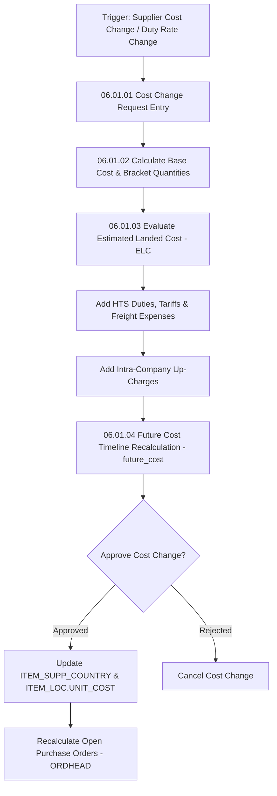

# RMS Costing & Expenses - RRL 16 Business Process Flows (RRM 06 & 09)

This reference documents the official Oracle **Retail Reference Model (RRM 06 Sourcing & RRM 09 Purchasing Costing)** business process flows, base cost maintenance, Estimated Landed Cost (ELC) calculation, expense up-charge allocation, and future cost timeline calculations.

---

## 1. Process Overview & Key Operational Roles

Costing & Expenses calculates total landed cost per unit across complex global supply chains, factoring base supplier cost, freight terms, HTS customs duties, tariffs, insurance, port handling expenses, and intra-company up-charges.

### Operational Roles:
- **Costing Specialist / Buyer**: Defines supplier base unit costs, expense formulas (`COST_ZONE_GROUP`), and up-charge templates (`UPCHARGE`).
- **Costing Engine (`costchg` / `future_cost`)**: Recalculates effective net unit cost and ELC across active POs and future cost timelines.
- **Customs Broker / Freight Forwarder**: Ingests actual landed cost charges for 3-way expense audit.

---

## 2. Core Business Process Workflows

---

## 3. Sub-Process Breakdown & ELC Formula

### Sub-Process 06.01.03: Estimated Landed Cost (ELC) Formula
$$\text{ELC} = \text{Base Unit Cost} + \sum \text{Customs Duty} + \sum \text{Freight Expenses} + \sum \text{Up-Charges}$$

1. **Base Unit Cost**: Negotiated supplier cost (`ITEM_SUPP_COUNTRY.UNIT_COST`).
2. **Customs Duties & Tariffs**: Calculated from HTS tariff codes and country of origin.
3. **Expense Components**: Specific handling fees (e.g. $0.50/unit origin handling, 2% marine insurance).
