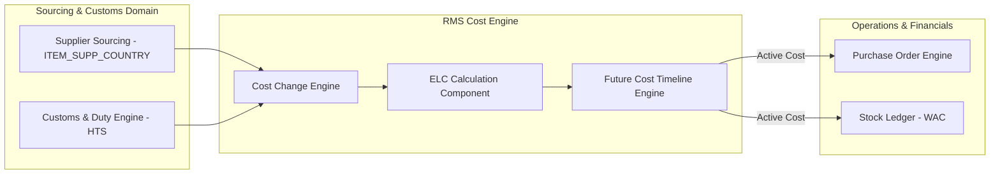

# RMS Costing & Expenses - RRL 16 Product Architecture (RRA & RSG)

This reference documents the **Oracle Retail Reference Architecture (RRA)** costing product domain mappings, Future Cost engine integration topology, and **Retail Service Group (RSG)** interface specs for Costing & Expenses.

---

## 1. Enterprise Costing Product Architecture

---

## 2. RSG Integration Schemas & Interfaces

| Service Interface | Payload Schema | Description |
| :--- | :--- | :--- |
| **`CostChangePub`** | `CostChangeDesc` | Publishes approved cost changes to planning, WMS, and ReIM systems. |
| **`ELCUpd`** | `ELCDesc` | Transmits updated Estimated Landed Cost (ELC) components. |
