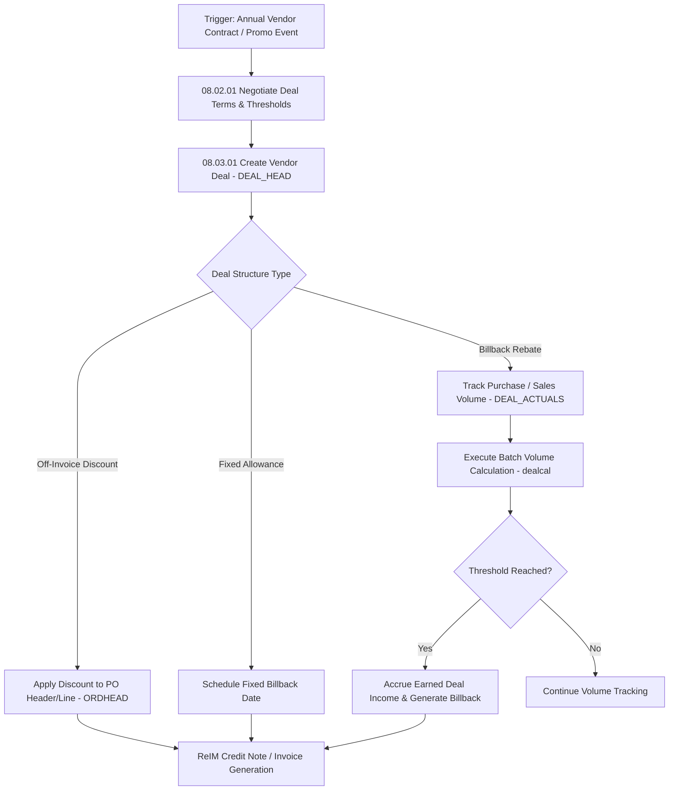

# RMS Vendor Deals & Rebates - RRL 16 Business Process Flows (RRM 08)

This reference documents the official Oracle **Retail Reference Model (RRM 08 Vendor & Deal Management)** business process flows, deal creation, threshold rebate calculations, promotional deal funding, and deal income accrual processes.

---

## 1. Process Overview & Key Operational Roles

Vendor Deal Management governs annual rebate agreements, promotional funding, billbacks, fixed allowances, and volume-threshold rebates negotiated between retailer category managers and suppliers.

### Operational Roles:
- **Category Manager / Deal Negotiator**: Negotiates vendor terms, enters deal structures, configures rebate tiers.
- **Deal Calculation Engine (`salstage` / `dealcal`)**: Tracks purchase/sales volumes, calculates earned deal income, updates PO discounts.
- **Accounts Receivable (AR) / ReIM Specialist**: Generates vendor billback invoices (`INVC_HEAD`) and collects rebate funds.

---

## 2. Core Business Process Workflows

---

## 3. Sub-Process Breakdown & Calculation Logic

### Sub-Process 08.03.01: Deal Definition & Tiers
1. **Deal Components**: Defined in `DEAL_HEAD` and `DEAL_DETAIL` (e.g. 2% rebate on purchases over $100K, 5% over $500K).
2. **Deal Scope**: Can be applied at Department, Class, Subclass, Item Parent, or SKU level across target stores or company-wide.

### Sub-Process 08.02.08: Process Rebates & Accruals
1. **Income Accrual**: As POs are received or POS sales occur, `dealcal` calculates earned rebate income and posts financial accruals to `TRAN_DATA_HISTORY` (Code 70 - Deal Income).
2. **Vendor Billback Invoicing**: Automatically creates credit invoice in ReIM to offset vendor payables.
