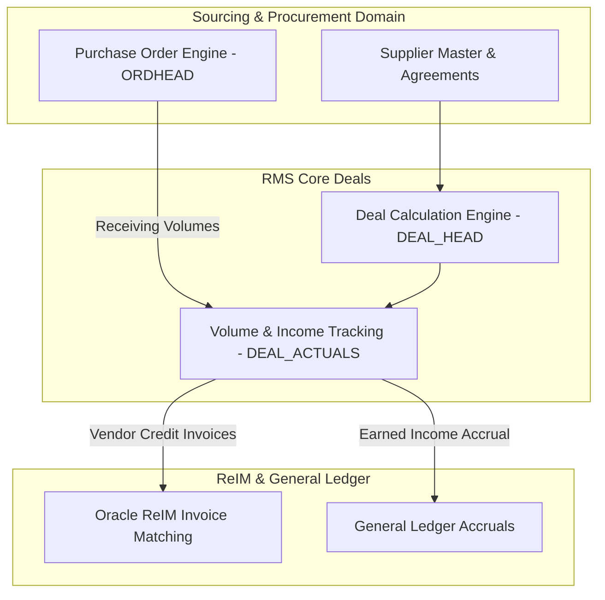

# RMS Vendor Deals & Rebates - RRL 16 Product Architecture (RRA & RSG)

This reference documents the **Oracle Retail Reference Architecture (RRA)** deal management product domain mappings, financial accrual topology, and **Retail Service Group (RSG)** interface specs for Vendor Deals & Rebates.

---

## 1. Enterprise Deal Product Architecture

---

## 2. RSG Integration Schemas & Interfaces

| Service Interface | Payload Schema | Description |
| :--- | :--- | :--- |
| **`VendorDealPub`** | `VendorDealDesc` | Transmits approved deal structures to external planning systems. |
| **`DealIncomeOut`** | `DealIncomeDesc` | Exports earned deal income and vendor billbacks to Financials/GL. |
