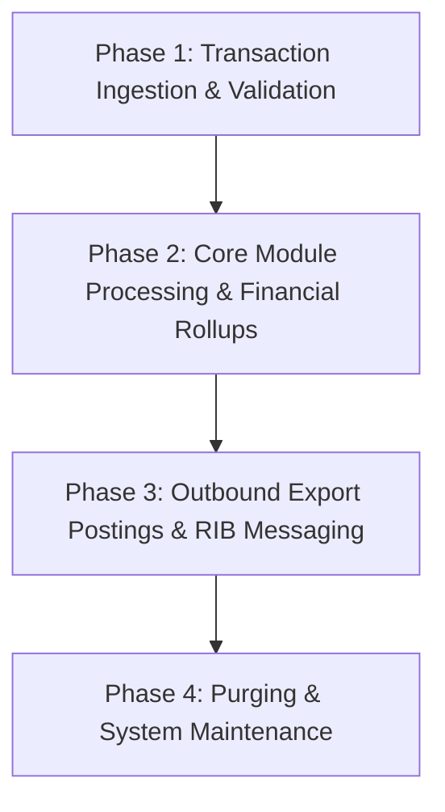

# Future Cost - Operations & Batch Job Reference

Technical documentation of nightly batch processing cycles, C/Pro*C programs, restart/recovery threading, and RIB messaging interfaces for Future Cost.

---

## 1. Nightly Batch Architecture & Execution Schedule

---

## 2. Key Batch Programs & Threading Parameters

- **`rms_future_cost_batch`**: Core batch execution program. Processes records in multi-threaded chunks based on store/department threading settings.
- **Restart/Recovery Integration**: Utilizes `RESTART_CONTROL` and `RESTART_PROGRAM_STATUS` tables to enable seamless job resume upon execution failure.

