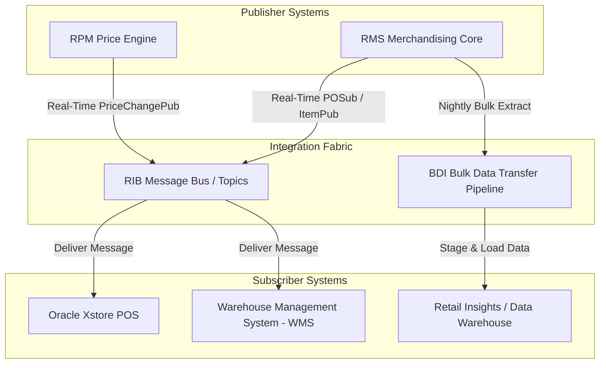

# RMS Integration APIs - RRL 16 Business Process Flows (RRA & RSG)

This reference documents the official Oracle **Retail Reference Architecture (RRA Enterprise Integration)** business process flows, data exchange patterns, asynchronous RIB message flows, and BDI batch data integration.

---

## 1. Process Overview & Key Operational Roles

Enterprise Integration connects Merchandising Operations Management (MOM), Retail Financial Planning, Science/Optimization, Store Systems (Xstore), Warehouse Management (WMS), and Enterprise ERP systems.

### Operational Integration Frameworks:
- **Oracle Retail Integration Bus (RIB)**: Asynchronous, real-time message bus for event-driven transactions (Sales, POs, Allocations, Items, Transfers).
- **Oracle Bulk Data Integration (BDI)**: High-performance bulk data Movement engine between MOM foundation tables and Retail Insights / Planning.
- **Oracle Retail Service Backbone (RSB)**: Web-service (SOAP/REST) request-response pattern for synchronous operational calls.

---

## 2. Enterprise Data Flow Lifecycle

---

## 3. Core Message Lifecycle & Error Handling

1. **Publication Queueing**: Source system writes to queue table (e.g. `ORDER_MFQUEUE`, `ITEMLOC_MFQUEUE`).
2. **RIB Hospital Pattern**: If a target subscriber application (e.g., WMS) is unavailable or payload validation fails, the message is routed to the **RIB Hospital** (`RIBHOSPITAL`) for manual audit and retry without blocking downstream messages.
