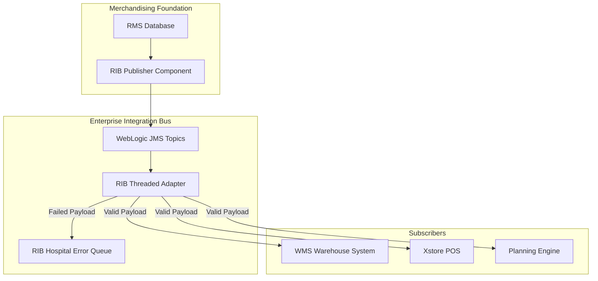

# RMS Integration APIs - RRL 16 Product Architecture (RRA & RSG)

This reference documents the **Oracle Retail Reference Architecture (RRA)** integration blueprint, product domain service interfaces, and **Retail Service Group (RSG)** canonical data model payload specifications.

---

## 1. Enterprise Integration Topology

---

## 2. RSG Canonical Message Catalog

| Service Topic | Business Object Payload | Key Target Subscribers |
| :--- | :--- | :--- |
| **`etItem`** | `ItemDesc` | WMS, Xstore, RPAS, OMS, Commerce |
| **`etVendor`** | `VendorDesc` | WMS, ReIM, Oracle Financials |
| **`etPOSub`** | `VendorOrderDesc` | WMS, SIM, ReIM |
| **`etAlloc`** | `AllocDesc` | WMS, SIM |
| **`etTsf`** | `TransferDesc` | WMS, SIM |
| **`etPriceChange`** | `PriceChangeDesc` | Xstore POS, Commerce |
| **`etReceiving`** | `ReceiptDesc` | RMS, ReIM |

---

## 3. Architecture Design Guidelines

1. **Canonical Payload Standard**: All RIB payload schemas strictly conform to the RSG XML / JSON schemas.
2. **Guaranteed Delivery**: WebLogic JMS persistent messaging guarantees once-and-only-once message delivery semantics across network boundaries.
