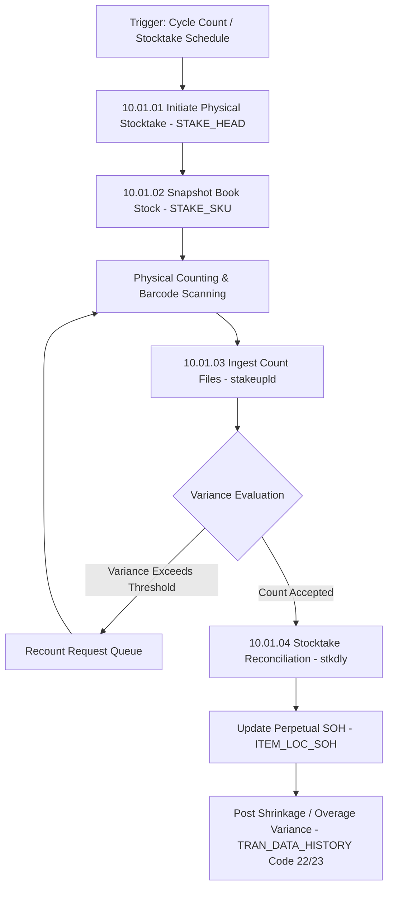

# RMS Inventory & Stocktake - RRL 16 Business Process Flows (RRM 10)

This reference documents the official Oracle **Retail Reference Model (RRM 10 Inventory Management)** business process flows, inventory adjustment lifecycles, physical stocktake count reconciliation, and unavailable stock status management.

---

## 1. Process Overview & Key Operational Roles

Inventory Management tracks perpetual stock-on-hand (SOH), unavailable inventory buckets (RTV hold, damaged, layaway, transfer hold), physical stocktake counts (STAKE), and stock adjustment reasons.

### Operational Roles:
- **Inventory Control Manager**: Conducts stock adjustments, initiates physical inventory counts, manages stock bucket transfers.
- **Store / DC Warehouse Associate**: Counts physical inventory, scans barcodes, inputs variance counts.
- **Stock Audit Engine (`stkdly` / `stakeupld`)**: Reconciles book stock vs physical stock count and posts shrink/overage variances to Stock Ledger (`TRAN_DATA_HISTORY`).

---

## 2. Core Business Process Workflows

---

## 3. Sub-Process Breakdown & Inventory Bucket Shifts

### Sub-Process 10.01.05: Inventory Status & Bucket Transfers
1. **Perpetual SOH Formula**:
   $$\text{Total SOH} = \text{Stock On Hand} + \text{In-Transit} - \text{Customer Reserved}$$
2. **Unavailable Inventory Shift**: Shifting inventory from available SOH to unavailable bucket (`INV_STATUS_QTY`) for Reasons like Damage, Customer Hold, QC Testing, or RTV Hold.

---

## 4. State & Database Data Flow

| Inventory Action | Source Physical Table | Target Table / Audit |
| :--- | :--- | :--- |
| **Physical Count Import** | `STAKE_CONT_TEMP` | `STAKE_QTY` |
| **Stock Count Freeze** | `ITEM_LOC_SOH` | `STAKE_SKU` (Snapshot) |
| **Adjustment Execution** | `INV_ADJ` | `ITEM_LOC_SOH.STOCK_ON_HAND` |
| **Financial Audit** | `INV_ADJ` | `TRAN_DATA_HISTORY` (Code 22 - Shrink, 23 - Overage) |
