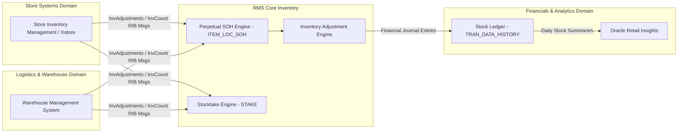

# RMS Inventory & Stocktake - RRL 16 Product Architecture (RRA & RSG)

This reference documents the **Oracle Retail Reference Architecture (RRA)** product domain mappings, store/DC inventory topologies, and **Retail Service Group (RSG)** service interfaces for Inventory Management.

---

## 1. Enterprise Inventory Product Architecture

---

## 2. RSG Integration Interfaces

| Service Interface | Payload Schema | Description |
| :--- | :--- | :--- |
| **`InvAdjustPub`** | `InvAdjustDesc` | Real-time RIB message for store/warehouse inventory adjustments. |
| **`InvCountPub`** | `InvCountDesc` | Real-time RIB message for stocktake count files from hand scanners/rfid. |
| **`InvStatusPub`** | `InvStatusDesc` | Transmits inventory status bucket transfers (Available <-> Unavailable). |

---

## 3. Data Integrity Principles

1. **Single Source of Inventory Truth**: RMS `ITEM_LOC_SOH` is the system of record for total company stock on hand across all store and warehouse locations.
2. **Asynchronous Lock-Free Updates**: High-volume inventory transactions utilize queue tables (`ITEM_LOC_MFQUEUE`) and GTT temporary tables to eliminate table locking during peak store hours.
