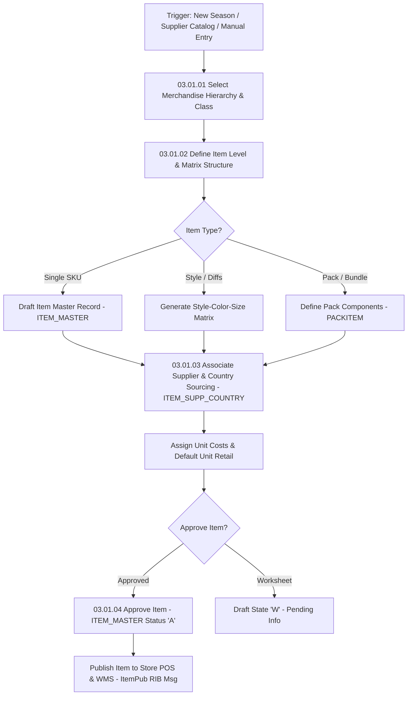

# RMS Item Master - RRL 16 Business Process Flows (RRM 03)

This reference documents the official Oracle **Retail Reference Model (RRM 03 Merchandise Foundation)** business process flows, item creation, hierarchy assignment, style-color SKU matrix generation, item-supplier sourcing ranging, and item induction lifecycles.

---

## 1. Process Overview & Key Operational Roles

Item Master Management establishes the foundational merchandise catalog hierarchy (Division, Group, Department, Class, Subclass), defining item levels (Item Parent, SKU, Component), supplier sourcing (`ITEM_SUPP_COUNTRY`), barcode UPC/EAN mappings, and item ticket specifications.

### Operational Roles:
- **Merchandise Data Steward / Buyer**: Defines item attributes, assigns hierarchy, links primary suppliers, configures pack components.
- **Item Induction Engine (`sitindct` / `itemindct`)**: Processes bulk item upload staging files (`SVC_ITEM_MASTER`), validates attributes, and approves new item records.
- **Store & Downstream Applications**: Receives item publication messages (`ItemPub` / `etItem`) to range items in store POS and e-Commerce catalogs.

---

## 2. Core Business Process Workflows

---

## 3. Sub-Process Breakdown & State Transitions

### Sub-Process 03.01.02: Item Level Hierarchy Structure
1. **Level 1**: Item Parent (Style level, e.g. T-Shirt).
2. **Level 2**: SKU (Transaction level item, e.g. T-Shirt Red Size Medium).
3. **Level 3**: Component SKU (for complex packs/bundles).

### Sub-Process 03.01.04: Item Approval & Ranging Lifecycle (`ITEM_MASTER.STATUS`)
- `W` (Worksheet) -> Draft state.
- `S` (Submitted) -> Awaiting manager approval or supplier data validation.
- `A` (Approved) -> Item active, enabled for purchase ordering (`ORDHEAD`), ranging (`ITEM_LOC`), and store sales.
- `C` (Closed) -> Discontinued item.
