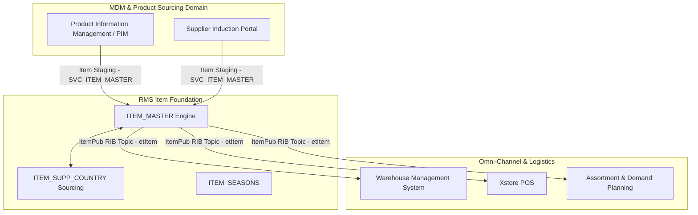

# RMS Item Master - RRL 16 Product Architecture (RRA & RSG)

This reference documents the **Oracle Retail Reference Architecture (RRA)** merchandise foundation product domain mappings, Master Data Management (MDM) integration topology, and **Retail Service Group (RSG)** canonical message payload specs for Item Master.

---

## 1. Enterprise Item Product Architecture

---

## 2. RSG Integration Schemas & Interfaces

| Service Interface | Payload Schema | Description |
| :--- | :--- | :--- |
| **`ItemPub`** | `ItemDesc` | Real-time RIB publication of created, modified, or approved item records. |
| **`ItemHdrMod`** | `ItemHdrDesc` | Publishes item header attribute changes (descriptions, diffs, hierarchy reclassifications). |
| **`ItemSuppMod`** | `ItemSuppDesc` | Transmits supplier sourcing changes and primary supplier updates. |

---

## 3. Architecture Principles

1. **Master Data Repository**: RMS is the single source of truth for merchandise hierarchy structure and transactional item SKU IDs.
2. **Asynchronous Multi-Threaded Induction**: High-volume item uploads use `CORESVC_ITEM_CONFIG` and `SVC_ITEM_*` staging tables with chunked multi-threading to process 100,000+ SKUs efficiently.
