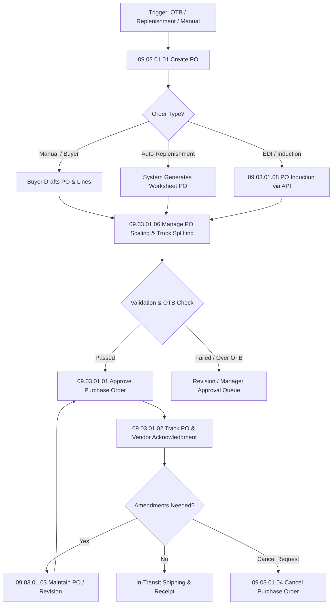

# RMS Purchase Orders - RRL 16 Business Process Flows (RRM 09)

This reference documents the official Oracle **Retail Reference Model (RRM 09 Purchasing Management)** business process flows, activity models, decision gates, and operational roles for Purchase Order Management in RMS 16.

---

## 1. Process Overview & Key Operational Roles

Purchasing Management encompasses the end-to-end procurement lifecycle from initial purchase order (PO) generation to supplier confirmation, order tracking, scaling, amendment, and cancellation.

### Operational Roles:
- **Buyer / Inventory Analyst**: Creates, evaluates, scales, and approves purchase orders.
- **Supplier / Vendor**: Receives PO notifications, confirms availability/cost, sends ASNs (Advance Ship Notices).
- **Merchandising Enterprise**: Validates open-to-buy (OTB), financial budgets, item-location ranging, and landed cost models.

---

## 2. Core Business Process Workflows

---

## 3. Sub-Process Breakdown & Activity Steps

### Sub-Process 09.03.01.01: Create & Approve Purchase Order
1. **Trigger**: Reorder point breached, manual buyer decision, or deal investment buy opportunity.
2. **Item-Supplier Ranging Validation**: RMS verifies item-supplier-country relationship exists (`ITEM_SUPP_COUNTRY`) with valid primary supplier flag.
3. **Costing & Expenses Calculation**: Estimated Landed Cost (ELC), base unit cost, duty/tariff components, and up-charges are evaluated.
4. **Approval Lifecycle (`ORDHEAD.STATUS`)**:
   - `W` (Worksheet) -> Draft state.
   - `S` (Submitted) -> Awaiting manager approval or OTB validation.
   - `A` (Approved) -> Order finalized, OTB committed, purchase order transmitted to vendor via EDI/RIB.

### Sub-Process 09.03.01.06: Manage PO Scaling & Truck Splitting
1. **Goal**: Optimize freight costs by scaling order quantities to meet supplier minimum order quantity (MOQ), pallet limits, or full truckload (FTL) capacity.
2. **Scaling Drivers**: Weight, Volume (Cube), Total Amount, or Pallet Count.
3. **Execution**: Quantities on `ORDLOC` are proportionally scaled up or down based on pre-configured vendor scaling rules.

### Sub-Process 09.03.01.05: Manage Investment Buy
1. **Trigger**: System identifies temporary vendor cost discount or price increase threshold.
2. **Analysis**: Evaluates forward-buy holding costs, carrying costs, and warehouse storage availability against prospective deal savings.
3. **Outcome**: Generates investment buy purchase order with optimized forward-buy quantity.

### Sub-Process 09.03.01.03: Maintain & Revise Purchase Order
1. **Triggers**: Supplier cost change notification, ship date delay, cancel date extension, or partial line cancellation.
2. **Revision Tracking**: Incrementing `ORDHEAD.REVISION_NO` and auditing original vs revised quantities/costs in revision tables (`REV_ORDHEAD`, `REV_ORDLOC`).

---

## 4. Integration & State Data Flow

| Process Step | Source Entity | RMS Physical Tables | Target System / Interface |
| :--- | :--- | :--- | :--- |
| **PO Creation** | Buyer UI / Replenishment | `ORDHEAD`, `ORDLOC`, `ORDSKU` | Internal RMS Engine |
| **PO Approval** | RMS Business Logic | `ORDHEAD` (`STATUS='A'`) | RIB `POSub` Pub Service |
| **EDI Transmission** | RIB Message Bus | `ORDHEAD`, `ORDLOC` | Vendor EDI 850 Outbound |
| **Vendor ACK** | Vendor Portal / EDI 855 | `ORDHEAD`, `REV_ORDHEAD` | EDI 855 Inbound |
| **Receipt & Matching** | Warehouse / Store | `SHIPMENT`, `SHIPSKU`, `INVC_HEAD` | ReIM 3-Way Matching |
