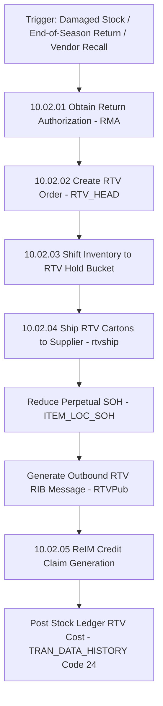

# RMS Return to Vendor (RTV) - RRL 16 Business Process Flows (RRM 10 & 08)

This reference documents the official Oracle **Retail Reference Model (RRM 10 Inventory & RRM 08 Vendor Management)** business process flows, RTV request creation (`RTVREQ_HEAD`), stock hold reservation, shipment, and credit memo claim generation.

---

## 1. Process Overview & Key Operational Roles

Return to Vendor (RTV) governs the return of damaged, obsolete, or over-shipped merchandise back to suppliers for credit memo reimbursement or replacement shipments.

### Operational Roles:
- **Inventory Control Manager / Buyer**: Negotiates return authorization (RMA), creates RTV request (`RTVREQ_HEAD`), approves RTV order (`RTV_HEAD`).
- **Store / DC Shipping Associate**: Scans cartons, places items in RTV unavailable stock hold (`INV_STATUS_QTY`), dispatches carrier shipment.
- **Accounts Payable (AP) / ReIM Specialist**: Reconciles vendor credit notes against generated RTV credit requests.

---

## 2. Core Business Process Workflows

---

## 3. Sub-Process Breakdown & State Lifecycles

### Sub-Process 10.02.02: RTV Status Lifecycle (`RTV_HEAD.STATUS`)
- `W` (Worksheet) -> Draft return request.
- `A` (Approved) -> RTV active, stock reserved in RTV hold bucket.
- `S` (Shipped) -> Cartons dispatched, SOH reduced, RTV credit claim logged.
- `C` (Cancelled) -> RTV cancelled, stock returned to sellable SOH.
