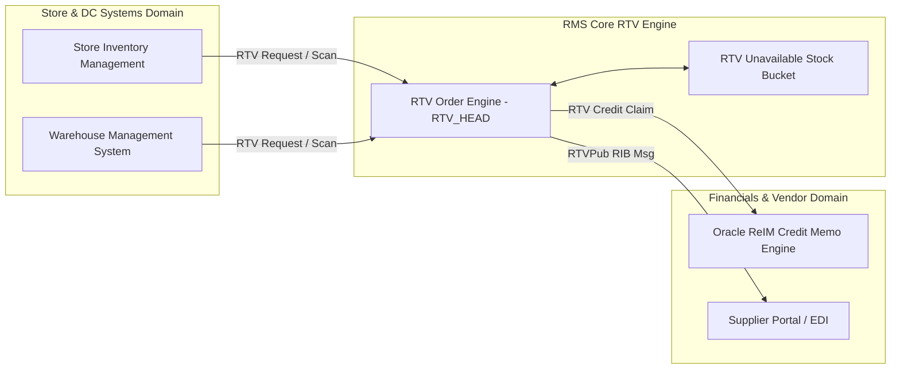

# RMS Return to Vendor (RTV) - RRL 16 Product Architecture (RRA & RSG)

This reference documents the **Oracle Retail Reference Architecture (RRA)** vendor return product domain mappings, store/WMS logistics topology, and **Retail Service Group (RSG)** interface specs for Return to Vendor (RTV).

---

## 1. Enterprise RTV Product Architecture

---

## 2. RSG Integration Schemas & Interfaces

| Service Interface | Payload Schema | Description |
| :--- | :--- | :--- |
| **`RTVPub`** | `RTVDesc` | Transmits approved RTV shipping orders to store SIM and warehouse WMS. |
| **`RTVCreditOut`** | `CreditClaimDesc` | Exports generated RTV credit requests to ReIM for vendor credit reconciliation. |
