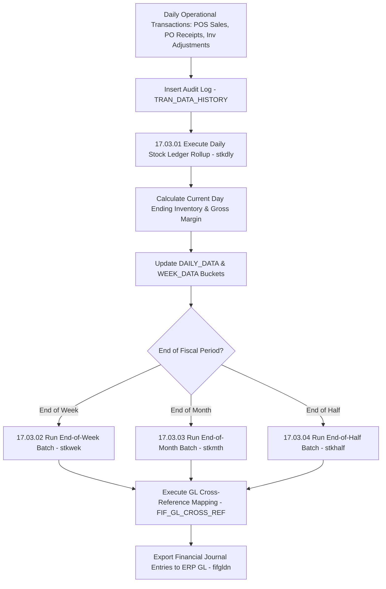

# RMS Stock Ledger Financials - RRL 16 Business Process Flows (RRM 17)

This reference documents the official Oracle **Retail Reference Model (RRM 17 Financial Control & Stock Ledger)** business process flows, stock ledger financial rollups, retail accounting method vs cost accounting method, and GL journal posting workflows.

---

## 1. Process Overview & Key Operational Roles

The RMS Stock Ledger maintains the financial valuation of inventory across all retail stores and distribution centers at Department/Class/Subclass or Location level, recording inventory receipts, sales, markdowns, shrink, and open-to-buy (OTB).

### Operational Roles:
- **Financial Controller / Retail Accountant**: Reviews gross margin, shrink accruals, cost-to-retail ratios, GL mapping (`FIF_GL_CROSS_REF`).
- **Stock Ledger Rollup Engine (`stkdly` / `stkwek` / `stkmth` / `stkhalf`)**: Summarizes daily transactions (`TRAN_DATA_HISTORY`) into weekly, monthly, and half-year financial rollups.
- **Enterprise ERP / GL System**: Ingests financial journal entries (`saexpgl` / `fifgldn`) for corporate balance sheet reporting.

---

## 2. Core Business Process Workflows

---

## 3. Sub-Process Breakdown & Accounting Methods

### Sub-Process 17.03.01: Retail Accounting Method (RAM) vs Cost Accounting Method (CAM)
1. **Retail Accounting Method (RAM)**:
   - Evaluates inventory based on retail value and derives cost value using Cumulative Markon Percentage (CMOP):
     $$\text{Cost Value} = \text{Retail Value} \times (1 - \text{CMOP})$$
2. **Cost Accounting Method (CAM)**:
   - Evaluates inventory directly at Weighted Average Cost (WAC) or FIFO unit cost.

### Sub-Process 17.03.05: General Ledger Mapping & Posting
- **GL Cross-Reference Engine**: Maps RMS transaction codes (e.g. 01 - Sale, 11 - Price Change, 20 - Receipt) to GL account combinations based on store location traits and department hierarchy.
