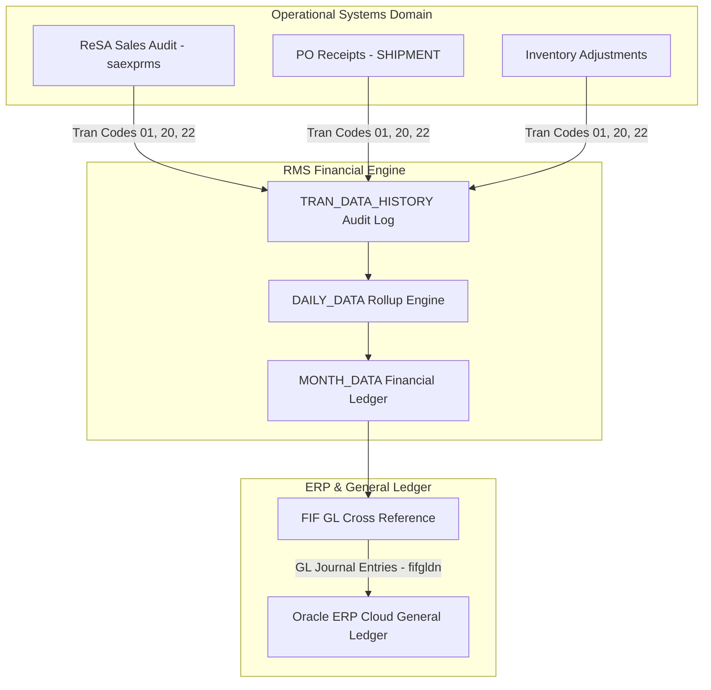

# RMS Stock Ledger Financials - RRL 16 Product Architecture (RRA & RSG)

This reference documents the **Oracle Retail Reference Architecture (RRA)** financial accounting product domain mappings, GL integration topology, and **Retail Service Group (RSG)** interface specs for Stock Ledger Financials.

---

## 1. Enterprise Financial Product Architecture

---

## 2. RSG Integration Schemas & Interfaces

| Service Interface | Payload Schema | Description |
| :--- | :--- | :--- |
| **`GLPostingOut`** | `GLPostingDesc` | Transmits aggregated financial debits and credits to corporate GL. |
| **`StockLedgerPub`** | `StockLedgerDesc` | Transmits weekly/monthly financial inventory valuation to Retail Insights (RI). |
