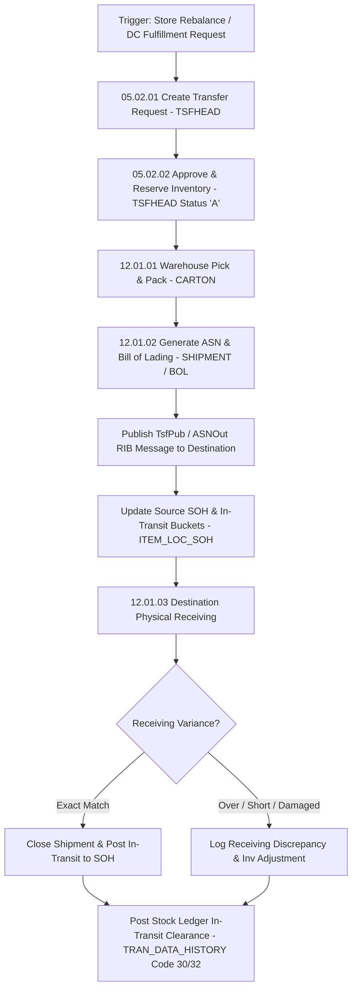

# RMS Transfers & Shipments - RRL 16 Business Process Flows (RRM 05 & 12)

This reference documents the official Oracle **Retail Reference Model (RRM 05 Supply Chain & RRM 12 Warehouse Management)** business process flows, inter-store transfer creation, ASN generation (`SHIPMENT`), freight scaling, and destination location receiving workflows.

---

## 1. Process Overview & Key Operational Roles

Inter-Store Transfers (TSF) and Location Shipments govern inventory movements between Stores, Warehouses, and External Finishers, managing picking, packing, bill of lading (BOL) manifests, in-transit stock tracking, and receipt reconciliation.

### Operational Roles:
- **Inventory Logistics Manager**: Creates transfer requests (`TSFHEAD`), approves inter-store balances, configures routing legs.
- **Warehouse / Store Shipper**: Scans cartons, generates ASNs (`SHIPMENT` / `SHIPSKU`), prints shipping manifests.
- **Destination Receiver**: Scans arriving cartons against transfer ASN, logs overages/shortages/damages (`SHIPSKU.QTY_RECEIVED`).

---

## 2. Core Business Process Workflows

---

## 3. Sub-Process Breakdown & State Transitions

### Sub-Process 05.02.02: Transfer Status Lifecycle (`TSFHEAD.STATUS`)
- `W` (Worksheet) -> Draft state.
- `A` (Approved) -> Source location inventory reserved (`TSF_RESERVED_QTY`).
- `S` (Shipped) -> Inventory moved from source `STOCK_ON_HAND` to destination `IN_TRANSIT_QTY`.
- `C` (Closed) -> Inventory fully received at destination location.

### Sub-Process 12.01.02: ASN & Shipment Building
- Cartons (`CARTON`) and SKU quantities (`SHIPSKU`) are linked to a single shipment (`SHIPMENT.SHIPMENT_NUMBER`).
- Generates outbound RIB `TsfPub` / `ASNOut` payload for real-time destination store notice.
