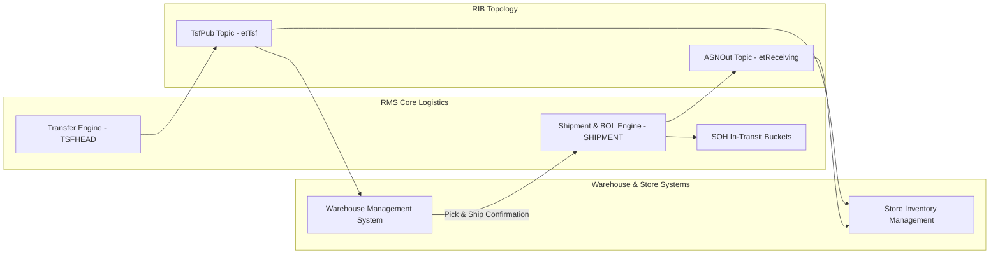

# RMS Transfers & Shipments - RRL 16 Product Architecture (RRA & RSG)

This reference documents the **Oracle Retail Reference Architecture (RRA)** logistics product domain mappings, supply chain interaction topology, and **Retail Service Group (RSG)** service interface specs for Transfers & Shipments.

---

## 1. Enterprise Logistics Product Architecture

---

## 2. RSG Integration Schemas & Interfaces

| Service Interface | Payload Schema | Description |
| :--- | :--- | :--- |
| **`TsfPub`** | `TransferDesc` | Publishes approved transfer requests to source WMS or store. |
| **`ASNOut`** | `ASNDesc` / `ShipmentDesc` | Transmits shipment ASN details and container contents to destination store/DC. |
| **`ReceivingIn`** | `ReceiptDesc` | Ingests receipt confirmations from destination store/DC into RMS `SHIPMENT`. |
