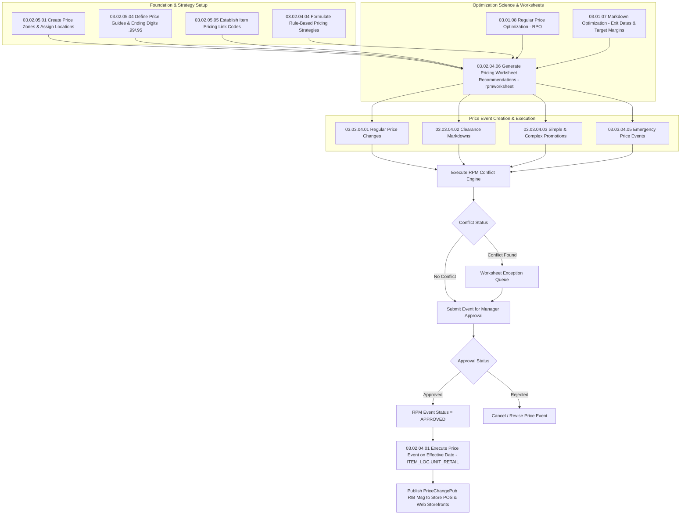

# RPM Pricing & Promotions - RRL 16 Business Process Flows (RRM 03)

This reference documents the comprehensive Oracle **Retail Reference Model (RRM 03 Retail Price Management - RPM)** business process flows, pricing foundation setups, price zone moves, price guides, price link codes, optimization science integration, and complete price event lifecycles.

---

## 1. Process Overview & Operational Roles

Retail Price Management (RPM) is Oracle's enterprise pricing engine. It governs regular retail price changes, clearance markdowns, promotional campaigns, pricing strategy tactics, and competitor price matching across physical stores and digital e-commerce channels.

### Operational Roles:
- **Pricing Administrator**: Configures price zones (`RPM_ZONE`), price guides (`RPM_PRICE_GUIDE`), link codes (`RPM_LINK_CODE`), and reason codes (`RPM_REASON_CODE`).
- **Category Pricing Analyst**: Defines pricing strategies (Margin, Competitive, Area Differential), reviews pricing worksheets (`rpmworksheet`), approves price changes.
- **Price Optimization Engine (RPO / MO)**: Calculates demand elasticities, recommended price points, and optimal markdown exit schedules.
- **Store Operations / POS (Xstore)**: Ingests executed price events (`PriceChangePub`) and updates store POS price databases / Electronic Shelf Labels (ESL).

---

## 2. Comprehensive RPM Process Architecture

---

## 3. Foundation Setup & Structural Processes

### Sub-Process 03.02.05.01: Price Zones & Location Zone Assignments
1. **Price Zone Groups (`RPM_ZONE_GROUP`)**: Logical grouping of price zones by store format (e.g. US Retail Stores, Express Stores, E-Commerce).
2. **Price Zones (`RPM_ZONE`)**: Clusters of stores sharing identical pricing strategies based on regional competition or demographics.
3. **Location Moves (`03.03.05.07`)**: Moving a store from one price zone to another triggers batch `PRICE_BATCH_TRAN` to align the store's active retails with the new target zone.

### Sub-Process 03.02.05.04: Price Guides & Ending Rules
1. **Price Guide (`RPM_PRICE_GUIDE`)**: Enforces charm pricing rules (e.g. any calculated price between $10.00 and $19.99 must end in `.99`).
2. **Cutoff Ratios**: Automatic rounding up or down depending on target cents threshold.

### Sub-Process 03.02.05.05: Item Link Codes
1. **Link Codes (`RPM_LINK_CODE`)**: Groups related items (e.g. different flavors of 2L soda) so that a price change on one item automatically applies to all linked items.

---

## 4. Optimization Science Integration (RPO & MO)

### Sub-Process 03.01.08: Regular Price Optimization (RPO)
1. **Price Elasticity Modeling**: Evaluates historical sales vs price changes to model demand curves.
2. **Recommendation Engine**: Recommends optimal retail price changes to maximize total gross margin dollars subject to competitive pricing boundaries.

### Sub-Process 03.01.07: Markdown Optimization (MO)
1. **Exit Date Management (`03.02.07.04`)**: Sets seasonal sell-through exit dates for fashion items.
2. **Weekly Markdown Schedule (`03.02.07.01`)**: Recommends optimal markdown percentages (25% -> 40% -> 60%) to clear remaining inventory prior to exit date while maximizing total clearance revenue.

---

## 5. Event Lifecycles & Conflict Resolution Engine

| Event Type | RPM Core Tables | Execution Logic & Conflict Rule |
| :--- | :--- | :--- |
| **Regular Price Change** | `RPM_PRICE_CHANGE` | Updates base retail (`ITEM_LOC.UNIT_RETAIL`). Checked against active clearance/promo events. |
| **Clearance Markdown** | `RPM_CLEARANCE` | Marks item as clearance (`ITEM_LOC.CLEAR_IND='Y'`). Overrides regular price changes. |
| **Simple Promotion** | `RPM_PROMO`, `RPM_PROMO_COMP` | Applies temporary retail reduction (Amount Off / Percent Off) for a defined date range. |
| **Complex Promotion** | `RPM_PROMO_COMP_DETAIL` | Multi-Buy, BOGO, Threshold spend promos processed by POS promo engine. |
| **Emergency Price Change** | `EMER_PRICE_HIST` | Bypasses lead-time checks for instant store POS price correction. |

---

## 6. Financial Audit & RIB Payload Schemas

1. **Financial Audit Posting**:
   - Executing a regular price change or clearance generates financial inventory revaluation audit rows in RMS `TRAN_DATA_HISTORY` (Code 11 - Regular Price Change, Code 12 - Clearance Markdown).
2. **RSG Integration Payloads**:
   - **`PriceChangePub`**: Publishes approved regular, clearance, and simple promo events to stores.
   - **`PromotionPub`**: Publishes complex promotional rules and multi-buy thresholds to POS.
