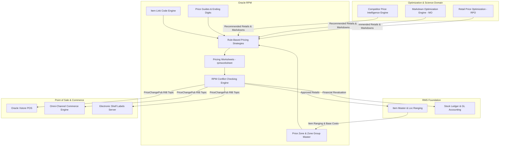

# RPM Pricing & Promotions - RRL 16 Product Architecture (RRA & RSG)

This reference details the **Oracle Retail Reference Architecture (RRA)** pricing product domain mappings, price optimization topology, price zone hierarchy architecture, and **Retail Service Group (RSG)** message interfaces for Retail Price Management (RPM).

---

## 1. Enterprise Pricing Product Architecture Blueprint

---

## 2. RSG Integration Schemas & Interfaces

| Service Interface | RSG Business Payload | Description |
| :--- | :--- | :--- |
| **`PriceChangePub`** | `PriceChangeDesc` | Real-time RIB publication of approved regular price changes, clearances, and simple promos to stores. |
| **`ClearancePub`** | `ClearanceDesc` | Transmits clearance markdown start/end dates, exit schedules, and markdown percentages. |
| **`PromotionPub`** | `PromotionDesc` | Transmits complex multi-buy, BOGO, threshold spend, and customer segment promo rules to POS. |
| **`PriceZonePub`** | `PriceZoneDesc` | Transmits price zone definitions and store-to-zone location mappings. |

---

## 3. Core Architectural Rules

1. **Decoupled Pricing Engine**: RPM operates as a dedicated standalone pricing service that writes executed unit retail changes down into RMS `ITEM_LOC.UNIT_RETAIL`.
2. **Zone Hierarchy Optimization**: Prices are maintained at **Company Level**, **Zone Level**, or **Store Level**. Zone pricing minimizes database volume while supporting localized competitive pricing strategies.
3. **Location Move Threading**: Moving a store between price zones triggers automated asynchronous threading (`PRICE_BATCH_TRAN`) to update active store pricing without blocking online POS transactions.
4. **Real-Time POS Price Synchronization**: Approved price events trigger RIB messages to store systems (`Xstore`) ahead of the effective date to permit pre-printing of shelf tags and promotional signage.
